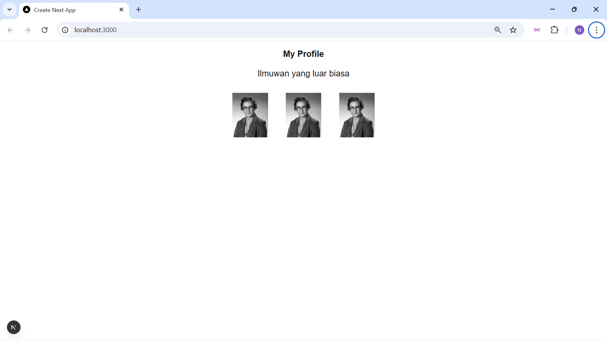
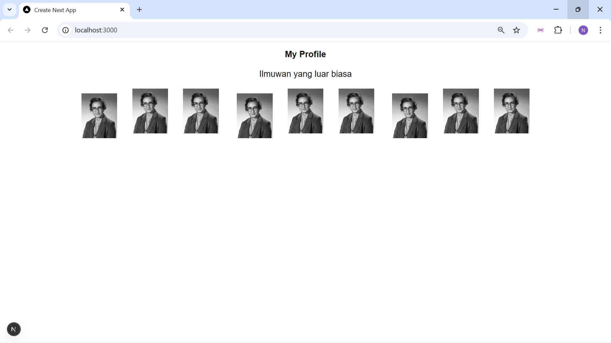
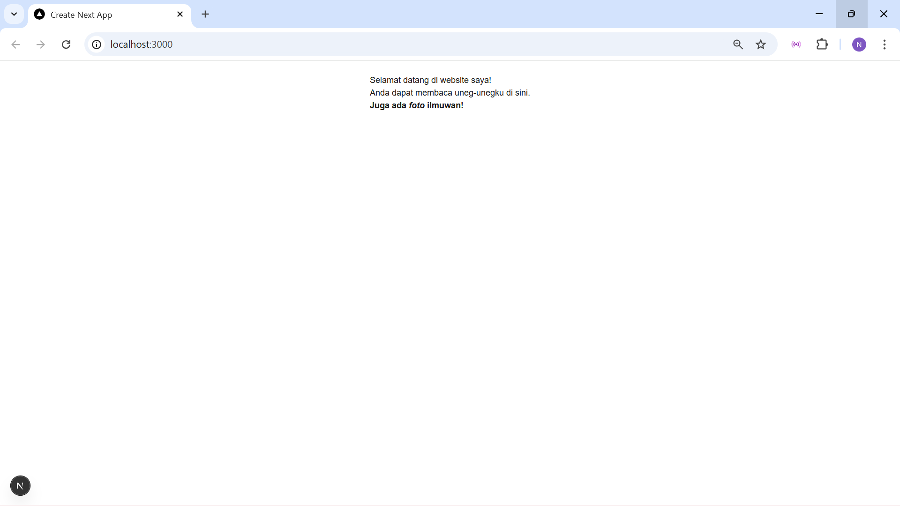
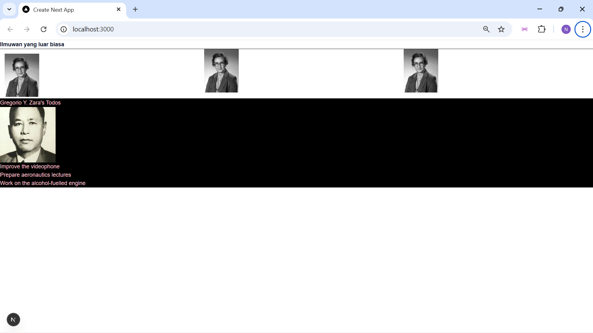
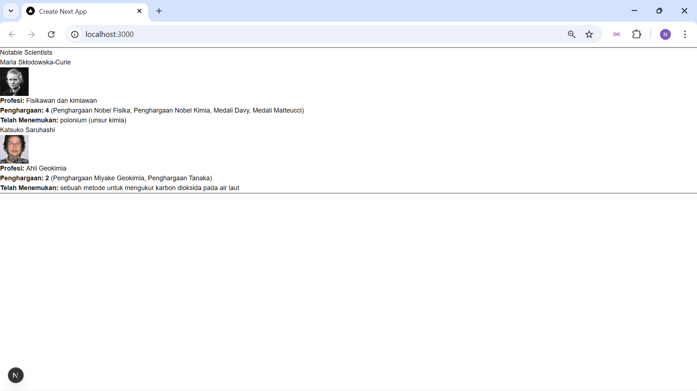
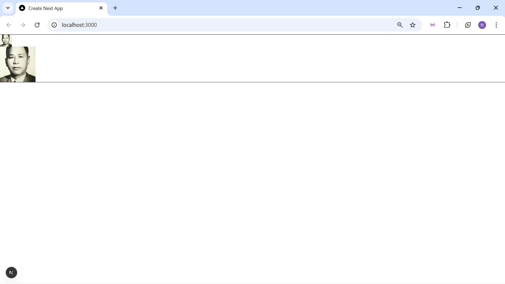

# W03 – Belajar Komponen (Next.js)

## Hasil Tampilan
Berikut adalah hasil implementasi komponen Profile pada halaman utama:

## Apa yang Saya Pelajari
Pada tugas ini saya mempelajari:
    Soal 1:
        - Cara membuat komponen React menggunakan function
        - Cara menggunakan komponen Image dari Next.js
        - Cara melakukan import komponen ke page.tsx
        - Cara menampilkan beberapa komponen dalam satu halaman
        - Pengaturan layout menggunakan flexbox
    Soal 2:
        - Cara membuat Named Export Components {Gallery}
        - Cara menggunakan komponen Gallery pada Page.tsx
    Soal 3:
        - JSX hanya boleh me-return satu elemen utama (root)
        - Atribut HTML `class` harus ditulis sebagai `className` (camelCase)
        - Tag HTML harus ditutup dengan benar seperti ` ` harus menggunakan ` `
    Soal 4:
        - JSX tidak dapat menampilkan object secara langsung
        - Data object harus diakses melalui properti tertentu
        - Penggunaan inline style pada JSX
    Soal 5:
        - Cara menggunakan JavaScript expression di JSX
        - Cara menggabungkan string dan variabel untuk URL gambar
        - Perbedaan antara string biasa dan expression pada JSX
        - Cara menampilkan gambar secara dinamis
    Soal 6:
        - Cara memisahkan logic ke file utility
        - Cara membangun URL gambar secara dinamis
        - Penggunaan props dan JSX expression
    Soal 7:
        - Menampilkan komponen Gallery
    Soal 8:
        - penggunaan props untuk mengontrol perilaku komponen
        - Jika `size` < 90  = `s`, `size` >= 90  = `b`

## Error yang Ditemui dan Solusinya
Soal 1: Saya sempat mengalami error saat menampilkan gambar dari URL eksternal.
Error tersebut disebabkan karena Next.js memerlukan konfigurasi khusus
untuk mengizinkan gambar dari domain luar.

Solusi:
    - Menambahkan konfigurasi `images.remotePatterns` pada file `next.config.ts`
    - Menyesuaikan hostname sesuai domain gambar (i.imgur.com)

Soal 3: Error terjadi karena JSX memiliki aturan yang lebih ketat
dibandingkan HTML biasa, sehingga penulisan yang tidak sesuai
akan menyebabkan error saat kompilasi.

Solusi:
Solusi dilakukan dengan membungkus elemen ke dalam satu parent,
memperbaiki atribut JSX, dan merapikan penulisan tag HTML.

Soal 4:
Error terjadi karena kode JSX mencoba merender object `person`
secara langsung di dalam elemen `<h1>`, padahal JSX hanya
mendukung string, number, atau expression yang valid

Solusi:
Mengakses properti `person.name` dari sebelumnya object `person`

Soal 5:
Error terjadi karena atribut `src` ditulis sebagai string,
sehingga JSX tidak mengeksekusi variabel di dalamnya.
Akibatnya URL gambar menjadi tidak valid dan gambar tidak tampil.

Solusi:
Solusi dilakukan dengan menggunakan JavaScript expression
menggunakan `{}` atau template literal untuk membentuk URL
gambar secara dinamis.

SOal 6:
Error terjadi karena penggunaan alias `@/`
yang belum dikonfigurasi di project serta
fungsi `getImageUrl` belum didefinisikan.

Solusi: Solusi dilakukan dengan membuat file utils
dan mengimpor fungsi menggunakan relative path
agar mudah dikenali oleh Next.js.

Soal 7:
"Binding element 'size' implicitly has an 'any' type" Error ini muncul karena TypeScript membutuhkan tipe data yang jelas
pada parameter props komponen.

Solusi:
    - Mendefinisikan tipe data menggunakan `type` pada props
    - Menyesuaikan pemanggilan fungsi `getImageUrl` agar menerima `imageId`
    bukan object

## Kesimpulan
Dengan tugas ini, saya memahami konsep dasar komponen di Next.js
dan cara menggunakannya kembali (reusable component).